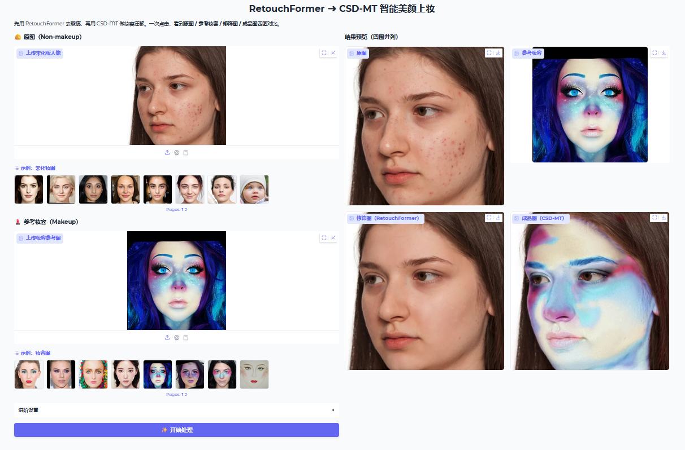

# ✨ 智能人脸修饰与美妆迁移系统
**RetouchFormer × CSD-MT 集成项目**

本项目是大创课题“基于深度学习的人脸智能修饰与妆容迁移系统”的实现部分。  
通过将 **RetouchFormer**（人脸瑕疵修饰）与 **CSD-MT**（无监督妆容迁移）串联，实现“先修饰、再上妆”的自动化流程，支持命令行与 Gradio 网页演示。

---

## 📂 项目结构

```text
beauty/
├─ CSD_MT/                        # CSD-MT 模型目录
│  ├─ CSD_MT/
│  │  ├─ model.py
│  │  ├─ modules.py
│  │  ├─ options.py
│  │  ├─ utils.py
│  │  └─ weights
│  ├─ run_csdmt.py
│  ├─ csdmt_api.py
│  ├─ examples/
│  │  ├─ non_makeup/             # 示例：未化妆图
│  │  └─ makeup/                 # 示例：妆容参考图
│  ├─ faceutils/                  # 人脸解析/分割（含 BiSeNet 权重）
│  └─ environment.yaml            # CSD-MT conda 环境
│
├─ retouchformer/                 # RetouchFormer 模型目录
│  ├─ retouch_infer/
│  ├─ release_model/              # 预训练权重（best）
│  ├─ model/
│  ├─ op/
│  ├─ test_images/
│  └─ environment.yaml            # RetouchFormer conda 环境
│
├─ tools/                 
│  ├─ batch_eval.py/              # 批量评价
│  ├─ fit_lambda_grid/            # 具体结果
│  └─ make_panels.py/             # 形成四排连图
├─ beauty_pipeline.sh             # ✅ 命令行一键流水线（先 RF 再 CSD-MT）
├─ app_inproc.py                  # ✅ Gradio 网页端（四图展示）
└─ environment.yaml               # 主环境（beauty）
```

**环境文件位置：**
- CSD-MT：`/root/autodl-tmp/beauty/CSD_MT/environment.yaml`
- RetouchFormer：`/root/autodl-tmp/beauty/retouchformer/environment.yaml`

---

## 🧠 模型简介

### RetouchFormer（人脸瑕疵修饰）
- 基于 Transformer 的半监督人脸修饰模型，自动定位瑕疵并以“软修复”方式填充自然肤质。
- **输入**：人脸原图 → **输出**：清洁自然的修饰结果。

### CSD-MT（无监督妆容迁移）
- 内容-风格解耦的妆容迁移方法，无需伪真值，迁移真实妆容细节。
- **输入**：修饰后图像 + 妆容参考 → **输出**：带妆成品。

**整体流程：** 原图 → RetouchFormer 修饰 → CSD-MT 上妆 → 成品

---

## ⚙️ 环境准备

使用各自 `environment.yaml` 创建环境（示例），最终用Retouchformer进行整合：
```bash
# CSD-MT
conda env create -f /root/autodl-tmp/beauty/CSD_MT/environment.yaml

# RetouchFormer
conda env create -f /root/autodl-tmp/beauty/retouchformer/environment.yaml
```

> 若需 GPU 推理，请确保 CUDA/驱动版本与 PyTorch 匹配。

---

## 🚀 命令行一键流水线（推荐）

脚本：`beauty_pipeline.sh`（已适配两个独立 conda 环境）。

### 单张处理
```bash
./beauty_pipeline.sh \
  --content /root/autodl-tmp/beauty/retouchformer/test_images/a.jpg \
  --style   /root/autodl-tmp/beauty/CSD_MT/inputs/style.jpg \
  --out     /root/autodl-tmp/beauty/outputs/a_beauty.jpg \
  --size    512
```

### 批量处理
```bash
./beauty_pipeline.sh \
  --content_dir /root/autodl-tmp/beauty/retouchformer/test_images \
  --style       /root/autodl-tmp/beauty/CSD_MT/inputs/style.jpg \
  --out_dir     /root/autodl-tmp/beauty/outputs_batch \
  --size        512
```

**参数说明：**
| 参数 | 含义 |
|---|---|
| `--content` | 单张未化妆人像 |
| `--style` | 妆容参考图 |
| `--out` | 单张输出路径 |
| `--content_dir` / `--out_dir` | 批量输入/输出目录 |
| `--size` | 推理分辨率（建议 512，同步用于 RF 与 CSD-MT） |

**说明：**
- RetouchFormer 输出会与输入文件同名写入临时目录，再传给 CSD-MT。
- 默认 `--align skip`（跳过人脸对齐），速度更快；需要可在脚本中改为 `face`。

---

## 💻 Gradio 网页演示（四图同屏）

脚本：`app_inproc.py`  
功能：上传**原图**与**妆容图**，一键输出 **原图 / 妆容 / 修饰 / 成品** 四图对比。

### 运行
```bash
python /root/autodl-tmp/beauty/app_inproc.py
# 浏览器访问：http://<服务器IP>:7860
```
>### 主要特性：###
>RetouchFormer 与 CSD-MT 在同一进程与 GPU 上推理，显著减少显存切换与IO耗时；
>自动 AMP 控制：RetouchFormer(AMP=关)，CSD-MT(AMP=开)；
>结果可视化直观展示修饰与上妆前后差异。
| 阶段       | 总耗时        | RetouchFormer | CSD-MT | 优化方式                |
| -------- | ---------- | ------------- | ------ | ------------------- |
| 原版（分进程）  | **15.90s** | 8.49s         | 7.35s  | 多环境切换 + IO传递        |
| 优化后（同进程） | **8.24s**  | 6.58s         | 1.66s  | 同进程 + AMP分策略 + 设备对齐 |

### 页面功能
- 示例图：读取 `CSD_MT/examples/non_makeup` 与 `CSD_MT/examples/makeup` 作为演示素材；
- 参数：分辨率（默认 512）、是否跳过对齐（align=skip）；
- 结果：四图并列显示，便于展示整个流水线。

> 如遇 “`Blocks.queue()` 参数不兼容” 报错，将 `demo.queue(concurrency_count=1)` 改为 `demo.queue()` 或使用 `default_concurrency_limit`（取决于 Gradio 版本）。

---

## 🔍 典型问题与建议

- **分辨率统一**：维持 RF 的 `--size` 与 CSD-MT 的 `--resize` 一致（推荐 512）。  
- **样式图质量**：正脸、光照均匀、高清妆容图效果更稳定。  
- **显存与速度**：若卡顿，可先用 384/448 验证流程，最终出图再回到 512。  
- **文件格式**：优先 JPG/PNG（sRGB），避免带 alpha 的 PNG。  
- **GPU 指定**：在脚本开头通过 `CUDA_VISIBLE_DEVICES=0` 选择显卡。

---

## 📈 示例输出


---

## 🧩 关键优化点

1. **同进程融合（In-Process Integration）**：去除子进程间通信与文件IO；  
2. **GPU与dtype统一**：所有中间张量 .to(self.device)；  
3. **分模型 AMP 控制**：RetouchFormer 保真关闭、CSD-MT 加速开启；  
4. **权重加载兼容修复**：strict=False 避免不匹配键；  
5. **显存复用与常驻加载**：减少初始化开销。  

---

## 📚 引用（参考文献）

- RetouchFormer：高质量人脸修饰 Transformer，具备缺陷定位与“选择性自注意力”以替换瑕疵纹理。  
- CSD-MT：内容-风格解耦的无监督美妆迁移方法，在无需伪真值的情况下实现自然妆容迁移。
